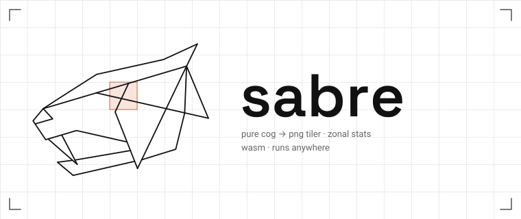

<p align="center">
  
</p>

<p align="center">
  <strong>A pure-Rust tile server for Cloud-Optimized GeoTIFFs.</strong><br>
  Range-reads COGs over HTTP, renders PNG map tiles and computes zonal statistics —
  no GDAL, no Python, no native dependencies.
</p>

<p align="center">
  <a href="#license"></a>
  
  
</p>

---

## What it is

`sabre` reads Cloud-Optimized GeoTIFFs the way they were designed to be read: it fetches
only the byte ranges it needs. A 40 GB raster on object storage costs the same to tile as a
40 MB one, because sabre never downloads the file — it reads the header, picks the right
overview level, and pulls just the tiles that intersect your viewport.

The entire stack is a single Rust crate with no C dependencies. It compiles to native code
and to WebAssembly, so the same renderer runs on a server or in a browser.

**Why not GDAL?** GDAL is excellent and sabre is not a replacement for it. GDAL is also
~2 million lines of C++ that you cannot compile to WASM, cannot run in a serverless
sandbox without a container, and cannot deploy in under 50 ms of cold start. sabre trades
GDAL's universality for a narrow, fast, dependency-free path through the COG format.

## Features

- **Tile rendering** — `z/x/y` PNG tiles with nearest-neighbour or bilinear resampling
- **Five style modes** — continuous colormap, RGB composite, hillshade, contour, classified
- **Zonal statistics** — point sampling and polygon min/max/mean/stdev from WKT geometry
- **Automatic overview selection** — picks the pyramid level matching the requested zoom
- **Geometry providers** — clip to a field by *naming* it, not by sending its boundary on
  every request: 561 bytes against 89 KB for a whole farm, with TWKB on the wire
- **Reprojection** — WGS84, Web Mercator, and UTM (WGS84 / NAD83) source rasters
- **Source caching** — the native binary keeps a GDAL-style, byte-bounded cache of the
  raster it reads, header and pixel data alike, so a warm tile costs no origin requests

## Quick start

```bash
git clone https://github.com/IndawoMaps/sabre.git
cd sabre
```

Start the tile server as a plain binary:

```bash
cargo run --release -p sabre-server
```

Or together with the demo map:

```bash
mise run dev          # server + file server + demo map
```

Either way it listens on port 8787. Then request a tile from any public COG:

```bash
curl -o tile.png "http://localhost:8787/tiles/0/0/0?url=https://example.com/dem.tif&colormap=viridis&min=0&max=3000"
```

## HTTP API

All endpoints take a `url` parameter pointing at the source raster, either in the query
string of a `GET` or in the body of a [`QUERY`](#query-requests). Three schemes are
supported:

| Scheme | Example | Notes |
| --- | --- | --- |
| `https://` | `https://data.example.com/dem.tif` | Server must support HTTP range requests |
| `file://` | `file://dem.tif` | Native binary only; resolved inside `--file-root`, disabled by default |

### `GET /tiles/{z}/{x}/{y}`

Renders a single PNG tile, in the usual slippy-map order.

Before v0.1.0 this was `/tiles/{x}/{y}/{z}`. The two orders cannot be told apart — 
`/tiles/3/5/10` is a legal request either way and means a different tile each way — so
there is no redirect and no shim, because either would sometimes serve the wrong tile
without saying so. Where the numbers only make sense the old way, the 400 says which
request you meant.

| Parameter | Default | Description |
| --- | --- | --- |
| `url` | *required* | Source COG |
| `mode` | `colormap` | `colormap`, `rgb`, `hillshade`, `contour`, or `classified` |
| `tile_size` | `256` | Output size in pixels, clamped to 64–512 |
| `interpolation` | nearest | Set to `bilinear` for smooth resampling |
| `nodata` | from file | Override the nodata value; matching pixels render transparent |
| `mask` | — | WKT polygon; pixels outside it render transparent |
| `geometry_provider`, `geometry_id` | — | Name a mask instead of sending one — see [Naming a geometry](#naming-a-geometry-instead-of-sending-it) |

**`mode=colormap`** — maps a single band through a colour ramp.

| Parameter | Default | Description |
| --- | --- | --- |
| `colormap` | `viridis` | See [colormaps](#colormaps) |
| `min` / `max` | `0` / `255` | Value range mapped across the ramp |

**`mode=rgb`** — composites bands 1–3 as red, green and blue.

| Parameter | Default | Description |
| --- | --- | --- |
| `rgb_min_r`, `rgb_min_g`, `rgb_min_b` | `0` | Per-channel black point |
| `rgb_max_r`, `rgb_max_g`, `rgb_max_b` | `255` | Per-channel white point |

**`mode=hillshade`** — analytical hillshade from elevation.

| Parameter | Default | Description |
| --- | --- | --- |
| `azimuth` | `315` | Light source direction in degrees |
| `altitude` | `45` | Light source elevation in degrees |
| `z_factor` | `1.0` | Vertical exaggeration |
| `hillshade_colormap` | — | Optional ramp blended under the shading |

**`mode=contour`** — quantises values into discrete bands.

| Parameter | Default | Description |
| --- | --- | --- |
| `contour_level` | `10` | Number of bands between `min` and `max` |
| `colormap` | `viridis` | Ramp the bands are drawn from |

**`mode=classified`** — maps value thresholds to explicit colours.

| Parameter | Description |
| --- | --- |
| `stops` | *required* — JSON array of `[threshold, color]` pairs |

Colours are either `"#rrggbb"` or `[r, g, b]`. Stops are sorted by threshold automatically:

```
stops=[[0,"#2166ac"],[500,"#f7f7f7"],[2000,[178,24,43]]]
```

### `GET /query`

Samples raster values. Provide either `lat` + `lng` for a point, or `polygon` as WKT.

| Parameter | Default | Description |
| --- | --- | --- |
| `url` | *required* | Source COG |
| `lat`, `lng` | — | Point to sample, in WGS84 |
| `polygon` | — | WKT polygon for zonal statistics, in WGS84 |
| `band` | `0` | Zero-based band index |
| `nodata` | from file | Values to exclude from statistics |

```bash
curl "http://localhost:8787/query?url=https://example.com/dem.tif&lat=37.8&lng=-122.4"
# {"kind":"point","value":52.0}

curl --get "http://localhost:8787/query" \
  --data-urlencode "url=https://example.com/dem.tif" \
  --data-urlencode "polygon=POLYGON((-122.5 37.7,-122.3 37.7,-122.3 37.9,-122.5 37.9,-122.5 37.7))"
# {"kind":"polygon","min":0.0,"max":281.0,"avg":47.3,"stdev":38.1}
```

`geometry_provider` and `geometry_id` name the polygon instead of carrying it — see
[Naming a geometry](#naming-a-geometry-instead-of-sending-it).

Polygon queries always read full resolution and are capped at 4 million pixels; larger
areas return an error rather than falling back to an overview. See
[Known limitations](#known-limitations).

### `GET /info`

Returns COG metadata — dimensions, band count, dtype, compression, nodata, EPSG code,
geotransform, WGS84 extent, centre, overview pyramid, and embedded statistics if present.
`GET /meta` is an alias.

### `GET /tile-info/{z}/{x}/{y}`

Returns which overview level a tile would read from and the pixel window it would touch,
without rendering anything. Useful for debugging coverage and pyramid selection.

### Server timing

Every tile and query answers with a `Server-Timing` header breaking the request
into phases, so where the time went is visible without a profiler. Browsers show
it in devtools; the load suite aggregates it into a distribution per phase.

```
server-timing: geom;dur=20.789, meta;dur=0.015, plan;dur=0.012, fetch;dur=0.004,
               decode;dur=0.307, blit;dur=0.026, resample;dur=0.133,
               mask;dur=2.159, style;dur=0.097, encode;dur=0.107
```

| Phase | What it covers |
| --- | --- |
| `geom` | Resolving clip geometry: a provider fetch, a cache hit, or parsing WKT |
| `meta` | Reading and parsing the COG header. Usually a cache hit |
| `plan` | Choosing the overview level and the pixel window |
| `fetch` | Byte ranges from the source, whether from the origin or the page cache |
| `decode` | Decompression and predictor |
| `blit` | Assembling decoded tiles into the read window |
| `resample` | Resampling onto the output grid |
| `mask` | Reprojecting the clip geometry and testing pixels against it |
| `style` | Colormap, hillshade, contour or RGB stretch |
| `encode` | PNG encoding |
| `stats` | Accumulating statistics, on `/query` |

A phase that did not happen is absent rather than reported as zero — a tile with
no clip has no `geom` or `mask`, which is different from having them cost
nothing. Errors carry no breakdown: a 400 spends its time deciding to be a 400.

The phases will not add up to the whole request. The remainder is the network,
the accept, and anything outside the instrumented path, and it is worth reading:
a large gap means time is going somewhere nothing is watching.

### `GET /health`

Returns `ok`.

### `QUERY` requests

Every endpoint above except `/health` also answers the HTTP
[`QUERY`](https://datatracker.ietf.org/doc/draft-ietf-httpbis-safe-method-w-body/) method:
a safe, idempotent, cacheable request that carries its parameters in the body instead of
the URL. Use it when a WKT `polygon` or `mask`, or a long list of `stops`, would not fit
in a query string. The parameters are exactly the ones the `GET` form takes, and the body
replaces the query string rather than adding to it.

Two body types are accepted, and the `Accept-Query` header on an `OPTIONS` or `405`
response lists them:

- `application/x-www-form-urlencoded` — the same `key=value` pairs, and what curl sends
  when no `Content-Type` is given:

  ```bash
  curl -X QUERY "http://localhost:8787/query" \
    --data-urlencode "url=https://example.com/dem.tif" \
    --data-urlencode "polygon=POLYGON((-122.5 37.7,-122.3 37.7,-122.3 37.9,-122.5 37.9,-122.5 37.7))"
  ```

- `application/json` — an object with the same keys. Numbers may be JSON numbers, and
  `stops` may be the array itself rather than a string:

  ```bash
  curl -X QUERY "http://localhost:8787/tiles/0/0/0" -H "Content-Type: application/json" \
    -d '{"url": "https://example.com/dem.tif", "mode": "classified",
         "stops": [[0, "#2166ac"], [500, "#f7f7f7"], [2000, [178, 24, 43]]]}'
  ```

Bodies are limited to 2 MB. `OPTIONS` on these endpoints answers the CORS preflight a
browser sends before a `QUERY`, so `fetch(url, { method: "QUERY", body })` works
cross-origin wherever the browser supports the method.

### Colormaps

`viridis` · `plasma` · `turbo` · `greys` (aliases `gray`, `grayscale`) · `rdylbu` ·
`spectral` · `reds` · `blues` · `greens` · `ylgnbu` · `hot`

## Naming a geometry instead of sending it

This is the way sabre is meant to be used for clipped work.

A farm block is 30–200 vertices. Sent as WKT on every tile request that clips to it, that
is kilobytes inbound for kilobytes of PNG back — for a small field the request is bigger
than the response, and a whole farm does not fit in a URL at all. Measured on a real
86-block farm and the Sentinel-2 scene under it:

| | request | tile p50 |
| --- | --- | --- |
| `mask=MULTIPOLYGON((…))` | 89,509 bytes — `414 URI Too Long`, needs a `QUERY` body | 3.41 ms |
| `geometry_provider=…&geometry_id=…` | **561 bytes** | **3.18 ms** |

160× smaller, and the geometry is parsed once rather than on every tile.

`mask` and `polygon` still work exactly as before. These name a geometry instead:

| Parameter | Description |
| --- | --- |
| `geometry_provider` | A provider the operator configured. Never a URL — see below |
| `geometry_id` | One id, or several comma-separated, which clip as one shape |
| `X-Geometry-Provider-Auth` *(header)* | Passed to the provider as `Authorization` |

```bash
curl -H "X-Geometry-Provider-Auth: Bearer $TOKEN" \
  "http://localhost:8787/tiles/17/74830/78427?url=…&geometry_provider=blocks&geometry_id=19519"

# a whole farm as one clip, in one request
curl -H "X-Geometry-Provider-Auth: Bearer $TOKEN" \
  "http://localhost:8787/query?url=…&geometry_provider=blocks&geometry_id=19519,19520,19523"
```

Sending both a literal geometry and a reference is a 400 rather than a precedence rule:
the two say different things, and quietly honouring one clips to a shape nobody asked for.

### What a provider should serve

**TWKB at precision 6, in WGS84 lon/lat, labelled `application/vnd.twkb`.** GeoJSON and
WKT are still accepted — the branch costs one byte comparison — but TWKB is what the
contract asks for, and what sabre stores internally whatever arrives.

| Format | A whole 86-block farm | Per vertex |
| --- | --- | --- |
| WKT | 89,509 B | ~35 B |
| GeoJSON | 197,928 B | ~77 B |
| **TWKB p6** | **7,298 B** | **~2.8 B** |

Precision 6 is six decimal places of longitude and latitude — about 11 cm, a fifth of a
Sentinel-2 pixel. It is lossy, and measured on the real block sets that loss is confined
where you would expect: sampling 160,000 points per set, 15/9/44 changed which side of the
boundary they fell on, and every one sat within **4.4 cm of a ring edge**. Rendered, that
is 7 pixels of 65,536 on a masked tile.

Two things are easy to get wrong:

- **Precision counts decimal places in the source CRS units.** p6 in degrees is 11 cm; p6
  in UTM metres is micrometres, whose deltas stop fitting in short varints and produce a
  payload *larger* than WKB. Geometry is always WGS84 lon/lat here.
- **Do not compress it.** A varint delta stream has no redundancy left — gzipping one
  block set took it from 8,339 to 8,731 bytes.

Optional TWKB header blocks — bbox, size, id list, Z/M, empty — are rejected rather than
skipped, because skipping one means guessing its length and guessing wrong turns the rest
of the stream into plausible-looking coordinates. `ST_AsTWKB(geom, 6)` emits none of them.

### Configuring providers

`geometry_provider` is a key into a registry, never a URL. A caller-supplied URL would
make sabre an open proxy — and one with the caller's credential attached to it.

```bash
sabre-server --geometry-providers @providers.conf
```

```text
# <name>=<geometry url>  [options]
blocks=https://api.example.com/blocks/{id}/geometry
farms=https://internal/geom/{id} access=https://internal/allowed?ids={ids} timeout=2000
```

| Option | Default | Description |
| --- | --- | --- |
| `access` | none | Access-check URL, `{id}` for one at a time or `{ids}` for a batch |
| `auth` | `yes` | Whether `X-Geometry-Provider-Auth` is forwarded to this provider |
| `timeout` | `5000` | Milliseconds |
| `max-bytes` | `1M` | An over-long response is an error, never a truncation |
| `precision` | `6` | TWKB decimal places the cached copy is stored at |
| `geometry-ttl` | `3600` | Seconds a resolved geometry is kept |
| `access-ttl` | `60` | Seconds an access decision is kept |

`SABRE_GEOMETRY_PROVIDERS` takes the same text.

Ids are accepted only if they are plainly names — letters, digits and `- _ . :`, at most
128 characters, no `..`. They are substituted into a URL the operator wrote, so anything
that could end a path segment or start a query is refused before it gets there.

### What `access` is for

Geometry is asked for constantly and changes almost never, so it has to be cached. Keying
that cache on the caller's credential is obviously safe and quietly expensive: ten users
looking at the same 86-block farm produce 860 fetches of 86 distinct polygons, and hold
all 860 in memory.

With an `access` endpoint the two questions are cached separately:

| Cache | Key | Holds | TTL |
| --- | --- | --- | --- |
| geometry | `(provider, id)` | canonical TWKB — **shared** | `geometry-ttl` |
| access | `(provider, credential, id)` | allow/deny | `access-ttl`, short |

Everything is stored as TWKB whatever the provider sent, so a GeoJSON provider and a TWKB
one leave identical entries behind, and one farm occupies 7 KB rather than 89 KB.

The same ten users then cause 86 geometry fetches, and — with a `{ids}` batch endpoint —
ten access calls rather than 860. The credential is never what is stored: it is hashed
into the key, so the cache is not a place tokens accumulate.

An access endpoint need only return a status: 2xx allows, 401/403/404 denies. A JSON body
listing the allowed ids may also be returned, and then every id asked about must appear in
it — a batch answer covering only some of them denies the rest. Any other status is an
error and is **not** cached, so a provider having a bad minute cannot become a denial that
outlives it.

Without `access` there is nothing to ask, and a shared entry would be a way for one caller
to read another's data. The credential then goes back into the geometry key: correct,
unshared, and visibly the operator's choice rather than a silent default.

## In the browser

The same renderer runs in a browser tab, with no tile server: `@sabremaps/ol` is an
OpenLayers source that reads the COG with range requests and draws tiles in a Web Worker.

```js
import TileLayer from 'ol/layer/Tile.js';
import { sabreSource } from '@sabremaps/ol';

map.addLayer(new TileLayer({
  source: await sabreSource('https://data.example.com/farm.tif', {
    style: { colormap: 'viridis', min: 0, max: 3000 },   // the HTTP API's names
  }),
}));
```

`@sabremaps/browser` is the part not tied to a map library. See
[packages/ol](packages/ol/README.md) and [packages/browser](packages/browser/README.md),
and `just example` for a running map. The raster's host has to allow CORS range requests.

## Using the library

`sabre-core` has no HTTP client of its own. You supply a `RangeReader` and it does the
rest, which is what lets the same code run on a server or in the browser:

```rust
use sabre_core::cog::{fetch_meta, RangeReader};
use sabre_core::render::{render_tile, StyleMode, TileRequest};

#[async_trait::async_trait(?Send)]
impl RangeReader for MyReader {
    async fn read_range(&self, offset: u64, length: u64) -> Result<Vec<u8>, String> {
        // fetch `length` bytes starting at `offset`
    }
}

let meta = fetch_meta(&reader).await?;
let png = render_tile(
    &TileRequest {
        z: 10, x: 163, y: 395,
        tile_size: 256,
        style: StyleMode::Colormap { name: "viridis".into(), min: 0.0, max: 3000.0, nodata: None },
        bilinear: true,
        mask: None,
    },
    &reader,
    &meta,
).await?;
```

## Supported formats

| | Supported |
| --- | --- |
| Compression | Uncompressed, LZW, Deflate (both tags), PackBits |
| Sample types | uint8/16/32, int8/16/32, float32, float64 |
| Layout | Tiled or stripped TIFF and BigTIFF, with or without overviews |
| Predictor | None (1), horizontal differencing (2), floating point (3) |
| Clip geometry | TWKB (preferred), GeoJSON, WKT — Polygon and MultiPolygon |
| Projections | EPSG:4326, 4269, 3857, UTM zones (WGS84 32601–32660 / 32701–32760, NAD83 26901–26923) |

Overviews are used wherever they are in the file. A cloud-optimised GeoTIFF puts every
IFD in the first few kilobytes; a plain one with overviews added afterwards puts them
after the image data, and sabre follows the chain there rather than silently reporting an
image with no overviews. On a real 3.6 MB stripped file whose overviews began at byte
2,422,976, that is the difference between a z=13 tile reading 1.77 MB and reading 0.52 MB.

## Known limitations

This is a v0.0.1. The following are known and tracked, not oversights:

- **Pixel data is read little-endian only.** TIFF headers are parsed for both byte orders,
  but sample decoding assumes little-endian. Big-endian (`MM`) rasters will produce
  incorrect values. GDAL writes little-endian by default, so this is rarely hit in practice.
- **JPEG-compressed tiles are passed through undecoded** rather than erroring.
- **Reprojection is limited** to the EPSG codes listed above. Other CRSs return an error.
- **Polygon queries do not use overviews.** They read band data at full resolution and
  reject any window larger than 4 million pixels, so continent-scale zonal statistics are
  not yet possible. Tile rendering *does* use overviews correctly.

## Repository layout

```
crates/
  core/       sabre-core — COG reader, renderer, query engine. No I/O, no HTTP.
  server/     sabre-server — HTTP API: axum on tokio, with a byte cache of the raster it reads.
  browser/    sabre-browser — the same renderer as WebAssembly, reading COGs over fetch.
  cli/        sabre — command-line interface (early).
packages/
  browser/    @sabremaps/browser — the wasm in a Web Worker, for any map library.
  ol/         @sabremaps/ol — an OpenLayers source built on it.
examples/
  openlayers/ Vite + OpenLayers: sabre-server tiles, and in-browser rendering via @sabremaps/ol.
  wasm/       Bare pages driving the wasm directly (`just browser` builds what they load).
bench/        An HTTP benchmark of sabre-server against titiler — see bench/README.md.
  py/         A rasterio/GDAL port of the same operations, for comparison.
  browser/    sabre against OpenLayers' own GeoTIFF source, in Chrome via Playwright.
docs/         Assets and documentation.
```

`core` deliberately knows nothing about the network. Everything I/O-shaped enters through
the `RangeReader` trait, which is what keeps the crate portable and the tests hermetic.

`server` is a tokio binary that reads sources with reqwest or from disk and keeps a
byte-bounded page cache of remote sources in memory.

It used to also build for `wasm32` as a Cloudflare Worker. That was dropped: sabre's
advantage is a long-lived process holding a byte cache of the raster it reads, and an
isolate cannot have one. Against a network origin the same repeated tile is **30 ms**
warm and **2,143 ms** with the cache switched off — and the Workers Cache API holds the
COG header, not the pixel pages. An edge deployment would have given up the thing that
makes this fast in order to save a hop it mostly does not take.

## Deployment

**Plain host.** Build once, copy the binary anywhere:

```bash
cargo build --release -p sabre-server
./target/release/sabre-server --bind 0.0.0.0:8787
```

| Option | Env | Default | Description |
| --- | --- | --- | --- |
| `--bind <addr>` | `SABRE_BIND` | `127.0.0.1:8787` | Address to listen on |
| `--file-root <dir>` | `SABRE_FILE_ROOT` | disabled | Enable `file://` sources, resolved inside `<dir>` |
| `--threads <n>` | `SABRE_THREADS` | CPU count | Request threads |
| `--cache-size <size>` | `SABRE_CACHE_SIZE` | `256M` | Memory for cached source data; `0` disables the cache |
| `--cache-ttl <secs>` | `SABRE_CACHE_TTL` | `3600` | How long cached data stays valid; `0` keeps it until evicted |

`file://` URLs are relative to the file root and cannot escape it, so
`--file-root /data` plus `url=file://dem.tif` reads `/data/dem.tif`.

Give it as much cache as the box can spare. It is the single biggest thing sabre does:
the same repeated tile over a network origin measures 30 ms warm against 2,143 ms with
`--cache-size 0`, and 41 tiles cost 1 origin request rather than 82.

The cache works the way GDAL's `VSICURL` cache does: every `http(s)://` source is read in
64 KB pages, pages already in memory are served from there, and each run of missing pages
costs one range request. Repeated tiles over a raster that fits in the cache never touch
the origin again; a raster larger than the cache is served least-recently-used. Pages
expire after the TTL, which is how a re-uploaded COG gets picked up without a restart.
`file://` sources are not cached because the operating system already does that.

**Browser.** The same renderer compiles to WebAssembly and reads COGs directly from
object storage, with no server in the path — see [`crates/browser/`](crates/browser/). It is the right
side of the line for farm-scale rasters: one property at 1–3 m is single-digit megabytes,
and a whole map of 126 tiles renders in **381 ms** from a 651 KB file, byte-identical to
what `sabre-server` produces.

```bash
just browser        # 443 KB wasm, 159 KB brotli
```

Two things the server path does not need and this one does:

- **CORS on the object store.** The bucket must allow `GET`/`HEAD` with the `Range`
  request header and expose `Content-Range`. Without it the browser refuses the read
  outright. There is no way around this from the client side.
- **The bytes are public to whoever loads the page.** A server can hold a credential and
  hand out tiles; a browser reading the raster directly cannot.

A 100–325 MB Sentinel scene stays on the server, where the cache is shared and the cold
read is absorbed once for everyone rather than by each visitor.

**Container.** The included `Dockerfile` produces a small image with the same binary:

```bash
docker build -t sabre .
docker run -p 8787:8787 -v /path/to/rasters:/data sabre --file-root /data
```

## Development

```bash
cargo test --workspace          # unit, snapshot and HTTP API tests
cargo bench -p sabre-core       # criterion benchmarks
cargo run -p sabre-server -- --file-root data   # native tile server, serving the .tif files in data/
mise run dev                    # server + demo map
```

Snapshot tests render synthetic fixtures and compare against committed PNGs. To
regenerate them after an intentional rendering change:

```bash
cargo test -p sabre-core -- --ignored generate_fixtures
```

Benchmarks default to a synthetic fixture. Point them at a real raster with:

```bash
SABRE_BENCH_FILE=path/to.tif SABRE_BENCH_ZOOM=9 cargo bench -p sabre-core
```

## Roadmap

- Overview-aware polygon queries, lifting the 4-megapixel zonal-statistics cap
- Tilepack generation in the CLI
- Broader CRS coverage

## License

`sabre` is released under the [Apache License 2.0](LICENSE.md).
